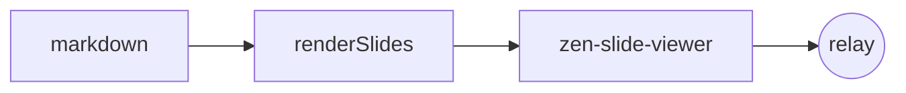

# ZenPre セルフホスト

markdown を置くだけのプレゼン

---

## これは何?

`@kuboon/zenpre` を読み込んだ **1 枚の静的 HTML**。

- ビルド不要(esm.sh から読み込む)
- スライド本文は自分のサイトの `slides.md`
- リアルタイム同期だけ `zenpre.deno.dev` の relay を借りる

---

## 使う relay 機能

- presenter の **ページ送り(focus)** に追従
- **リアクション** 絵文字がフワッと浮かぶ
- **質問(post)** を投げ、moderator 承認後に全員へ

---

## コード例

```html
<script type="module">
  import { defineComponents } from "@kuboon/zenpre/components.ts";
  defineComponents();
  const v = document.querySelector("zen-slide-viewer");
  await v.load({ markdown: await (await fetch("./slides.md")).text() });
  v.connect({ server: "https://zenpre.deno.dev", talkId: "…" });
</script>
```

---

## 図も描ける



---

## おわり

GitHub Pages に置けば、すぐ動く 🎉
